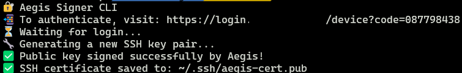
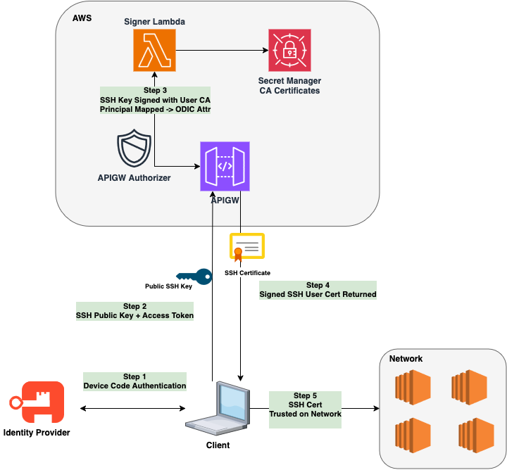

# Aegis SSH Certificate Signer

Aegis is a serverless SSH certificate authority built on AWS Lambda that simplifies SSH key management by issuing short-lived, signed certificates. It uses OpenID Connect (OIDC) for authentication and integrates with AWS Secrets Manager to securely manage the Certificate Authority (CA) private key.

Clients authenticate using the OIDC Device Authorization Flow. After successful authentication, the user's public key is sent to the Aegis API for signing. The signing function uses the OIDC ID token to map user attributes (e.g., email) to the SSH certificate's principal field.

This system provides short-term credentials and simplifies user management, making it easier to control access and minimize long-term key usage.

---




### How it Works 


### Configure User Client
Create a configuration file at ~/.ssh/aegis_config:
```
AUTH_DOMAIN="https://auth.example.com"
CLIENT_ID="ABCD"
AEGIS_ENDPOINT="https://xxxxxxxx.execute-api.us-east-1.amazonaws.com/prod/sign_user_key"
```

### Configure Terraform Deployment


Example `terraform.tfvars` file:

```hcl
jwt_audience        = ["AUD"]
jwt_issuer          = "https://auth.example.com/application/o/APP_NAME/"
user_ca_secret_name = "ssh_user_ca_pem"
```


