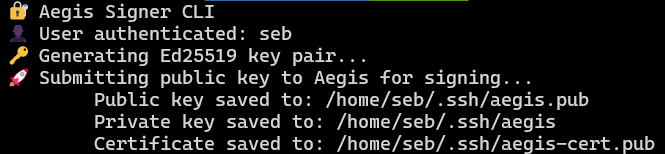

# Aegis SSH Certificate Signer

Aegis is a serverless SSH certificate authority built on AWS Lambda that simplifies SSH key management by issuing short-lived, signed certificates. It uses OpenID Connect (OIDC) for authentication and integrates with AWS KMS to securely manage the Certificate Authority (CA) private key.

Clients authenticate using the OIDC Device Authorization Flow. After successful authentication, the user's public key is sent to the Aegis API for signing. The signing function uses the OIDC ID token to map user attributes (e.g., email) to the SSH certificate's principal field.

All signing actions are recorded in an audit trail stored in DynamoDB, enabling traceability and accountability for each certificate issued.

This system provides short-term credentials and simplifies user management, making it easier to control access and minimize long-term key usage.

---




### How it Works 


## Setup from Source

### 1. Build the Project

```bash
make build
```

### 2.  Deploy AWS Infrastructure

Before deployment, ensure you have the following OAuth values:
- Audience
- Issuer URL

Then deploy the infrastructure:

```bash
cd terraform
terraform plan
terraform apply
```

### 3. Configure Aegis User Client
```bash
cat <<EOF >> ~/.config/aegis/config
AUTH_DOMAIN="https://login.example.com"
CLIENT_ID="ABCD"
AEGIS_ENDPOINT="https://abcx.execute-api.us-east-1.amazonaws.com"
DEFAUlt_TTL="24h"
AUTHENTICATION_METHOD="pkce"  #(pkce or device_code. pkce is the default if not set)
EOF
```

Alternatively, you can pass the values directly via the command line:
```bash
./aegis \
  -auth-url https://login.example.com \
  -clientid ABCD \
  -aegis-endpoint https://abcx.execute-api.us-east-1.amazonaws.com/...
  -ttl 1h
```


